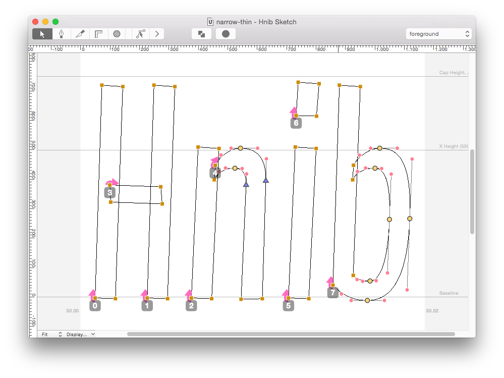
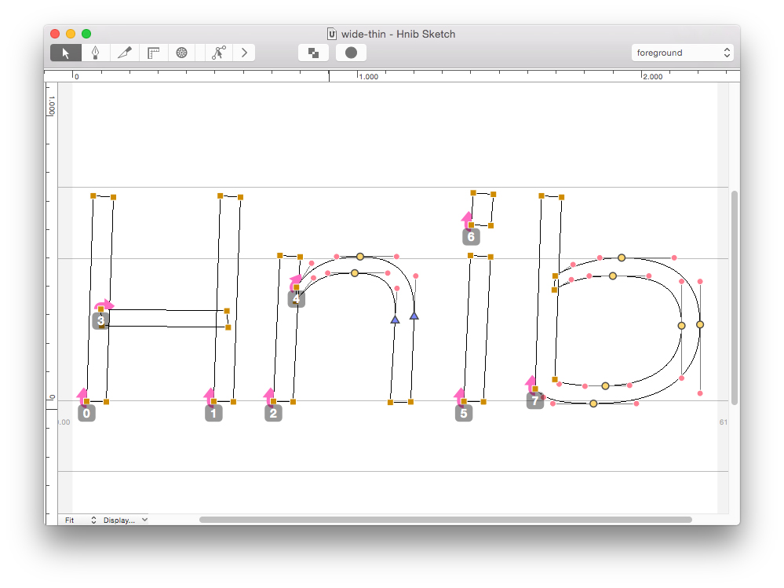
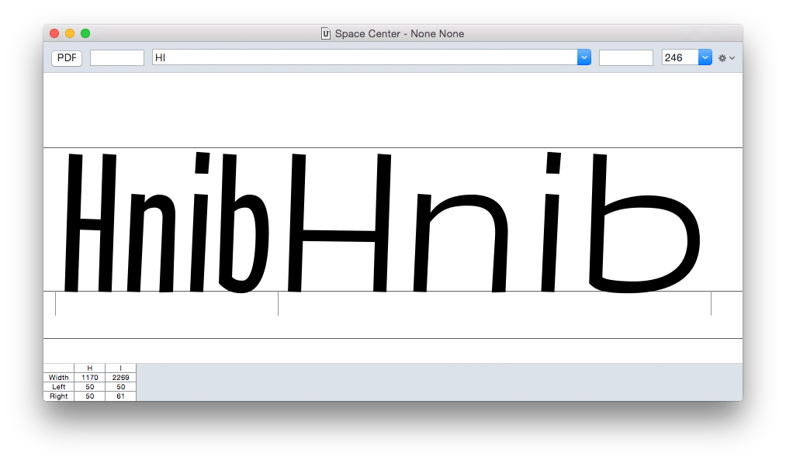
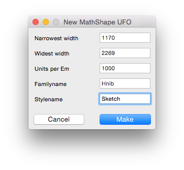
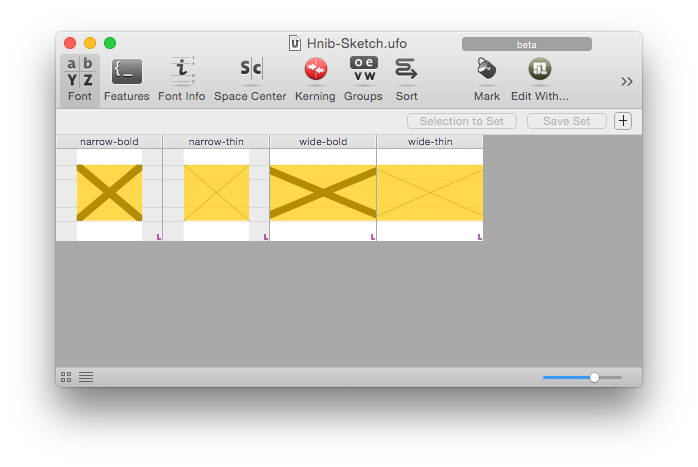
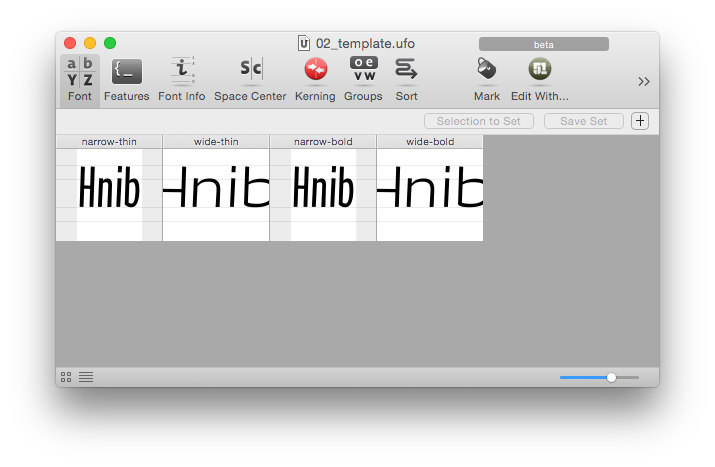
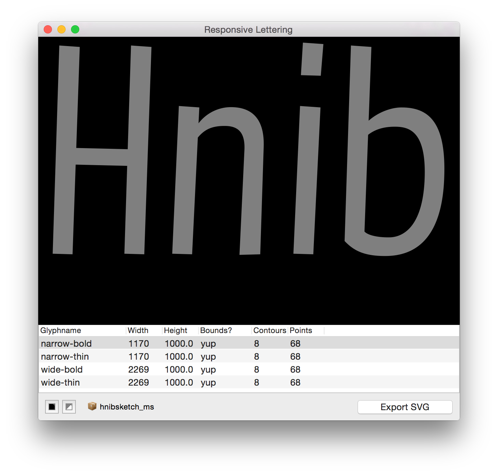

# Example Project

This document describes the steps in a small example project. There are many ways of doing this and the following steps are only an indication of how to work.

* sketch
* first digitisation
* a new template
* more animations

## Sketch
The sketch is a simple drawing, it keeps the baseline and the x-height more or less the same. Important: draw width variations, so one is narrow, the other is wide. The drawing can be scanned or photographed. 

## Digitisation

* In RoboFont the scan is placed in a new font, in a new glyph. At this stage it does not matter which glyph.
* Draw the outlines for the narrow version.
* For the wide version copy the narrow outlines and then **move** the points to make the wide. By moving you make sure the new version will be compatible and the interpolation will work. 

### Checking contour order

Hopefully the order of the points and contours is still the same. Select **Contour Indexes** from the view options in the bottom right of the glyph window.

But check if the wide version has the right order. You can change the order by cutting and pasting contours. 

## A New Template

* With the narrow and the wide versions done, have a look at how wide both images are in the Space Center. 

In this example the narrow drawing is **1170** units and the wide image is **2269** units. We can enter these values in the Responsive Lettering > "New Template" dialog.

When you click **Make** RoboFont will make a new UFO with the right glyphs. It will also ask for a place to save the UFO. Saving is good. 

The new UFO has 4 glyphs with names that indicate what they're for:

* Narrow Bold
* Narrow Thin
* Wide Bold
* Wide Thin

The yellow boxes are in the **bounds** layer and they are used for calculating the right size. The narrow glyphs need to have the same box, and the wide glyphs need to have the same box.

### Moving the glyphs to the template
Copy and paste the glyphs to the right glyphs in the template. We only have a narrow and a wide glyph, so duplicate the glyphs for now. 

### Preview and export
The **Preview and Export** dialog gives you a moving preview of the letters. You can change the background and foreground colors.

The table shows the width and height of the glyphs and if each glyph has the right rectangle in the bounds layer. The table also shows the number of contours and the total number of points.

## Troubleshooting

### Nothing shows up in the Preview?

* Do all the glyphs have the right names from the template?
* Do you have all 4 glyphs?
* Are the contours in the right order?
* Do all contours have the same number of points?

**Fix the contour order.**

### Some contours fly all over the place?

* This can happen if you have at least 2 contours with the same number of points. They interpolate, but with the wrong shape.

**Check the contour indexes.**

### I made a new template and saved and then when I opened it up again all glyphs were gone.

**Download the 1.3 version of the extension.**
